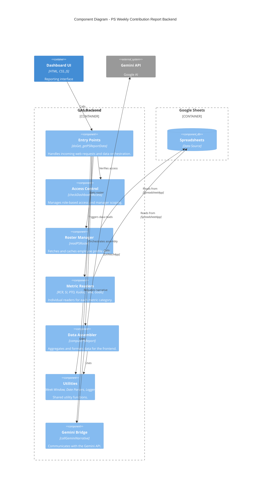

# Component Diagram - PS Weekly Contribution Report Backend

```mermaid
C4Component
  title Component Diagram - PS Weekly Contribution Report Backend

  Container(spa, "Dashboard UI", "HTML, CSS, JS", "Reporting interface")

  Container_Boundary(backend, "GAS Backend") {
    Component(entry, "Entry Points", "doGet, getPSReportData", "Handles incoming web requests and data orchestration.")
    Component(access, "Access Control", "checkDashboardAccess", "Manages role-based access and manager scoping.")
    Component(roster, "Roster Manager", "readPSRoster", "Fetches and caches employee profile data.")
    Component(metrics, "Metric Readers", "RCR, SI, PTO, Kudos, Time, Goals", "Individual readers for each metric category.")
    Component(assembly, "Data Assembler", "computePSReport", "Aggregates and formats data for the frontend.")
    Component(utils, "Utilities", "Week Window, Date Parsers, Logger", "Shared utility functions.")
    Component(gemini_logic, "Gemini Bridge", "callGeminiNarrative", "Communicates with the Gemini API.")
  }

  Container_Boundary(google_sheets, "Google Sheets") {
    ComponentDb(sheets, "Spreadsheets", "Data Source")
  }

  System_Ext(gemini_api, "Gemini API", "Google AI")

  Rel(spa, entry, "Calls", "google.script.run")
  Rel(entry, access, "Verifies access")
  Rel(entry, roster, "Gets roster")
  Rel(entry, metrics, "Triggers data reads")
  Rel(entry, assembly, "Orchestrates assembly")
  Rel(entry, gemini_logic, "Requests narrative")

  Rel(metrics, sheets, "Reads from", "SpreadsheetApp")
  Rel(roster, sheets, "Reads from", "SpreadsheetApp")
  Rel(gemini_logic, gemini_api, "Calls", "UrlFetchApp")

  Rel(assembly, utils, "Uses")
  Rel(metrics, utils, "Uses")
```
