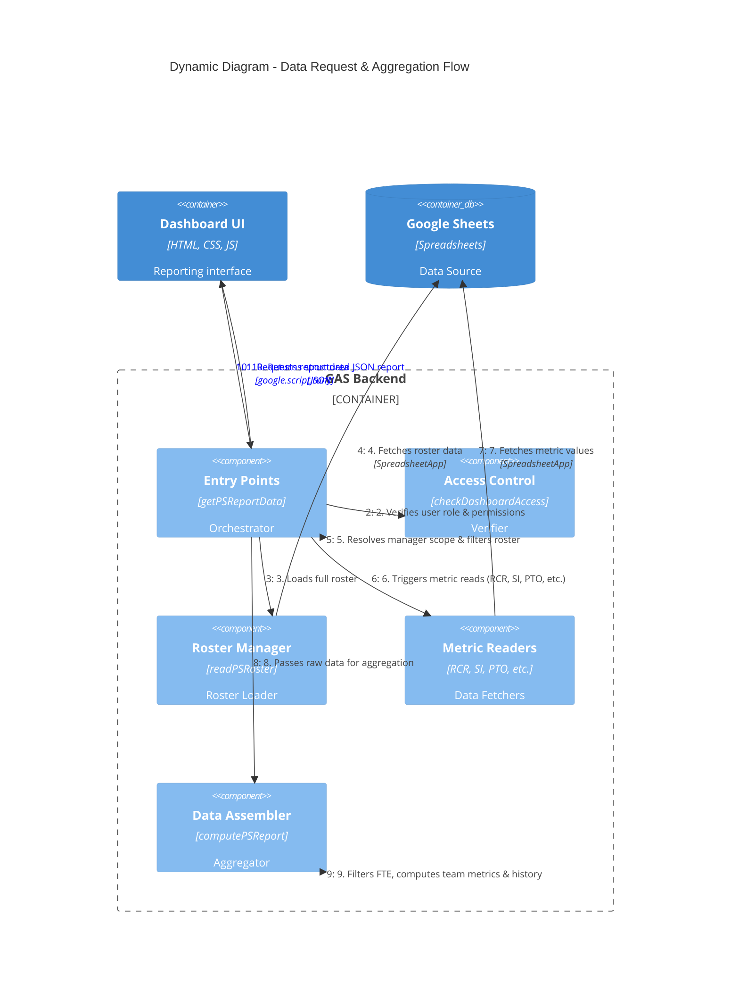

# Dynamic Diagram - Data Request & Aggregation Flow

```mermaid
C4Dynamic
  title Dynamic Diagram - Data Request & Aggregation Flow

  Container(spa, "Dashboard UI", "HTML, CSS, JS", "Reporting interface")
  
  Container_Boundary(backend, "GAS Backend") {
    Component(entry, "Entry Points", "getPSReportData", "Orchestrator")
    Component(access, "Access Control", "checkDashboardAccess", "Verifier")
    Component(roster, "Roster Manager", "readPSRoster", "Roster Loader")
    Component(metrics, "Metric Readers", "RCR, SI, PTO, etc.", "Data Fetchers")
    Component(assembly, "Data Assembler", "computePSReport", "Aggregator")
  }

  ContainerDb(sheets, "Google Sheets", "Spreadsheets", "Data Source")

  Rel(spa, entry, "1. Requests report data", "google.script.run")
  Rel(entry, access, "2. Verifies user role & permissions")
  Rel(entry, roster, "3. Loads full roster")
  Rel(roster, sheets, "4. Fetches roster data", "SpreadsheetApp")
  Rel(entry, entry, "5. Resolves manager scope & filters roster")
  Rel(entry, metrics, "6. Triggers metric reads (RCR, SI, PTO, etc.)")
  Rel(metrics, sheets, "7. Fetches metric values", "SpreadsheetApp")
  Rel(entry, assembly, "8. Passes raw data for aggregation")
  Rel(assembly, assembly, "9. Filters FTE, computes team metrics & history")
  Rel(entry, spa, "10. Returns structured JSON report", "JSON")

  UpdateRelStyle(spa, entry, $textColor="blue")
  UpdateRelStyle(entry, spa, $textColor="blue")
```
